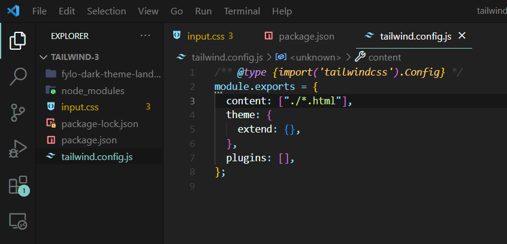
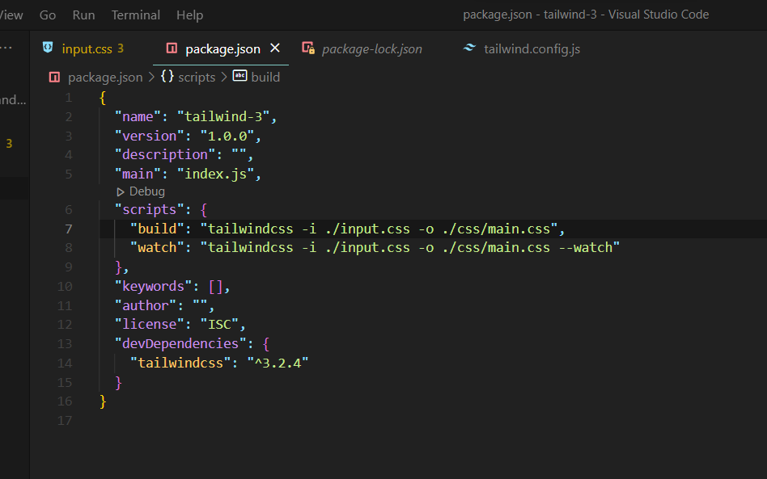

----Run the following commands---- 
npm init -y  
npm install -D tailwindcss  
npx tailwindcss init  
 
----Add the following lines in your tailwind.config.js file----  
content: ["./*.html"],  
  
 
----Now in package.json file----  
"scripts": { 
"build": "tailwindcss -i ./input.css -o ./css/main.css",  
"watch": "tailwindcss -i ./input.css -o ./css/main.css --watch"  
}, 
  
 
----Run----  
npm run build  

----Setup done!----  
Link your main.css file in your html file & Enjoy tailwind!!  
